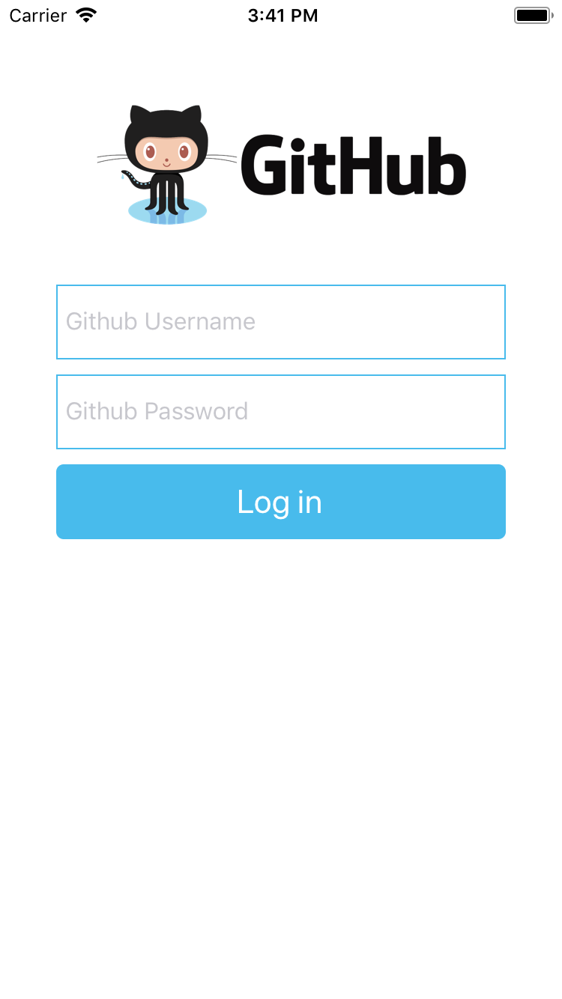

# React Native Tutorial
<div align="center">
    
    
    
</div>


This is an example react native app following Pluralsight tutorial available [here](https://app.pluralsight.com/player?course=build-ios-apps-react-native&author=hendrik-swanepoel&name=build-ios-apps-react-native)

# Set up your Environment
Install Brew:
```
/usr/bin/ruby -e "$(curl -fsSL https://raw.githubusercontent.com/Homebrew/install/master/install)"
brew -v
```
Install Node:
```
brew install node
node -v
```
Install Watchman:
```
brew install watchman
```
Install Git:
```
brew install git
git --version
```
Install React-Native CLI:
```
npm install react-native-cli -g
```
Install XCode Command Line Tools:
```
xcode-select --install
```
# To Run
```
git clone https://github.com/dtfiedler/react-native-github.git
npm install
react-native run-ios
```
